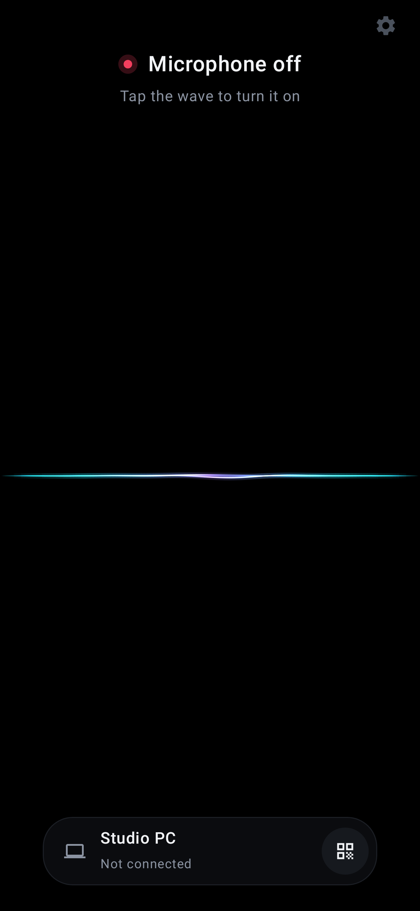
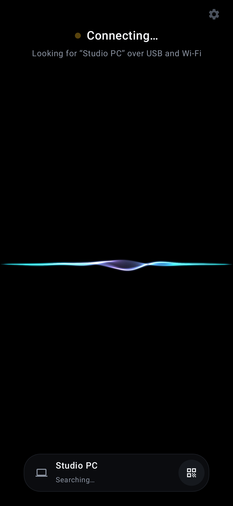
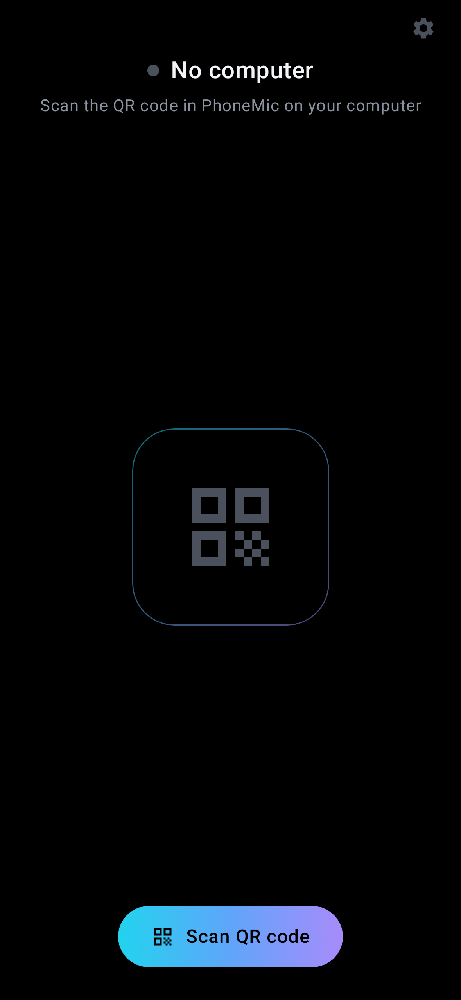
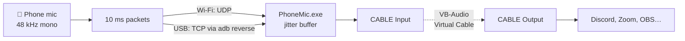

<p align="center">
  
</p>

<h1 align="center">PhoneMic</h1>

<p align="center">
  <b>Your Android phone as a microphone for Windows — over Wi-Fi or a USB cable.</b>
</p>

<p align="center">
  <a href="https://github.com/shamil-aminov/PhoneMic/actions/workflows/ci.yml"></a>
  <a href="https://github.com/shamil-aminov/PhoneMic/releases/latest"></a>
  <a href="https://github.com/shamil-aminov/PhoneMic/releases"></a>
  <a href="#requirements"></a>
  <a href="#requirements"></a>
  <a href="LICENSE"></a>
  <a href="https://aminov.sh/en/blog/phonemic"></a>
</p>

<p align="center"><i>Русская версия: <a href="README.ru.md">README.ru.md</a></i></p>


---

PhoneMic streams your phone's microphone to your PC, where Discord, Zoom, OBS
and every other program see it as an ordinary microphone. You pair once by
scanning a QR code, and from then on it is one tap on the phone.

It exists because the apps that already do this tend to fail in the same two
ways: the connection drops after a while, and getting it going is fiddly.
PhoneMic is built around not doing either.

## Features

- **One-time pairing by QR code.** The phone remembers the PC and finds it
  again even if its IP address changes.
- **Wi-Fi or USB, picked automatically.** With USB debugging on, the PC sets
  up the cable link by itself. Pull the cable and the phone moves to Wi-Fi at
  once; plug it back in and it returns to USB a few seconds later. The
  microphone never switches off in between.
- **Keeps going with the screen off.** A foreground service, a wake lock and
  Wi-Fi locks stop Android from muting the app or letting the radio doze.
- **Reconnects by itself** after any dropout, on either side.
- **An adaptive jitter buffer** that measures the network and holds exactly
  as much audio as it needs, in one of three modes (see below).
- **A tray app** on the PC with a level meter, volume, device choice and
  optional start with Windows.
- **Local only.** No account, no cloud, no analytics. Audio goes straight from
  the phone to the PC.

## Screens

| Off | Connecting | First launch |
| :---: | :---: | :---: |
|  |  |  |

The wave is the switch: tap it to turn the microphone on or off. It swells
with your voice on the phone and, from the audio that actually arrives, in the
PC window. The dot above it is red when the microphone is off, amber while the
phone looks for the PC and cyan when you are live. The island at the bottom is
the paired PC; the QR button on its right pairs a different one. Noise
suppression lives behind the gear icon.

Both apps are true black, which on an OLED screen costs no light at all.

## How it works



Windows cannot turn a program's output into a microphone without a driver, so
PhoneMic plays the audio into [VB-Audio Virtual Cable](https://vb-audio.com/Cable/),
a free and widely used virtual audio device. Its other end, **CABLE Output**,
is the microphone you pick in other programs.

## Requirements

- **PC:** Windows 10 or 11, 64-bit, and
  [VB-Audio Virtual Cable](https://vb-audio.com/Cable/).
- **Phone:** Android 8.0 or newer, with Google Play services for the built-in
  QR scanner.
- **For Wi-Fi:** the phone and the PC on the same network.
- **For USB (optional):** USB debugging enabled on the phone, and `adb` on the
  PC — it comes with Android Studio or the
  [platform tools](https://developer.android.com/tools/releases/platform-tools).

Both apps speak English and Russian and follow the system language. On
Android 13 and later the phone app's language can also be set on its own in
system settings.

## Getting started

1. **Install VB-Audio Virtual Cable** and restart if its installer asks.
2. **Download PhoneMic** from the [latest release](../../releases/latest):
   the `.apk` for the phone and `PhoneMic-…-windows-x64.exe` for the PC.
3. **Run the PC app.** When Windows asks whether PhoneMic may use the network,
   allow it — Wi-Fi does not work otherwise. A QR code appears.

   

4. **Install the app on the phone**, tap **Scan QR code** and point the
   camera at the QR code.
5. **Tap the wave.** The dot above it turns cyan once the PC is receiving.
6. **In Discord, Zoom or OBS**, choose **CABLE Output** as the microphone.

Closing the PC window hides it to the tray; the microphone keeps working.
Quit from the tray icon's menu.

## Connecting

| | Wi-Fi | USB |
| --- | --- | --- |
| Setup | none | USB debugging on the phone, `adb` on the PC |
| Typical latency | 50–100 ms | 30 ms |
| Affected by a busy network | yes | no |
| Charges the phone | no | yes |

The phone always tries USB first. It finds the PC on Wi-Fi by trying every
address in the QR code and, failing that, a broadcast, so a new IP from the
router does not break pairing.

## Buffer modes

Wi-Fi delivers packets unevenly. The buffer on the PC measures how late packets
arrive and keeps just enough audio to cover it. It absorbs the difference by
skipping or stretching pauses in speech, which nobody can hear, and by adjusting
playback speed by at most 1% when there are no pauses.

| Mode | Latency | When |
| --- | --- | --- |
| Low latency | 20–40 ms | USB, or excellent Wi-Fi |
| Balanced (default) | adapts, usually 50–100 ms | almost always |
| Stable | 100–150 ms | a crowded or weak Wi-Fi network |

## Troubleshooting

**Clicks or gaps on Wi-Fi.** Connect the phone to a 5 GHz network rather than
2.4 GHz, switch the buffer to *Stable*, or use USB. The log (below) records
network jitter every 10 seconds, which shows how bad the network really is.

**The phone does not connect over Wi-Fi.** Check that both devices are on the
same network and that Windows Firewall allows PhoneMic.exe (UDP and TCP port
50505). Networks with client isolation, such as many guest networks, block this
entirely; use USB there.

**"Could not open the microphone."** Android only grants the microphone to an
app that is on screen when it starts recording. Turn PhoneMic on while the
phone is unlocked; after that the screen can go off. A phone call also takes
the microphone for its duration.

**USB stops working while WO Mic is installed.** Some apps ship their own
older copy of `adb`, and each copy restarts the other's server. PhoneMic
recovers within three seconds, but closing the other app avoids the churn.

**The log** is at `%APPDATA%\PhoneMic\log.txt`, and the *Open log* link in the
PC window opens it.

## Privacy and security

PhoneMic talks only to the computer it is paired with, on the local network or
over the USB cable. It has no servers and sends nothing anywhere else.

Audio travels **unencrypted** across the local network. The pairing code in the
QR keeps other devices from streaming into your microphone by accident; it is
not protection against someone deliberately listening on your network. On a
network you do not trust, use the USB cable.

## Building

Requirements: Android Studio (or JDK 21+ and the Android SDK) and the .NET 10
SDK.

```bash
# Phone app
cd android
./gradlew assembleDebug

# PC app
dotnet build desktop/PhoneMic.sln
dotnet run --project desktop/src/PhoneMic
```

Release builds, signing and publishing are described in
[docs/RELEASING.md](docs/RELEASING.md).

## Testing

```bash
cd android && ./gradlew test                  # protocol tests on the phone side
dotnet test desktop/tests/PhoneMic.Core.Tests # protocol tests and network simulation on the PC side
```

Both sides check the same byte-exact packets, listed in
[docs/protocol.md](docs/protocol.md#test-vectors), so a wire format change on
one side fails the tests on the other. The jitter buffer is tested against a
simulated network on a virtual clock: ten minutes of streaming over bad Wi-Fi,
with clock drift, in a few seconds.

For end-to-end checks without anyone speaking, the phone app has a debug mode
that plays a 1 kHz tone instead of the microphone, and `probe` records what
comes out of the virtual cable and reports frequency, level and dropouts:

```bash
adb shell am start -n sh.aminov.phonemic/.MainActivity --ez autostart true --ez tone true
dotnet run --project desktop/tools/PhoneMic.Probe -- record "CABLE Output" 10
adb shell am start -n sh.aminov.phonemic/.MainActivity --ez stop true
```

## Project layout

```
android/                        Phone app: Kotlin, Jetpack Compose
  audio/                        Recording, the connection engine
  net/                          Wire protocol, UDP and TCP transports
desktop/src/PhoneMic.Core/      Server, jitter buffer, audio output, USB bridge
desktop/src/PhoneMic/           Window, QR code, tray (WPF)
desktop/tests/                  Protocol tests and the network simulation
desktop/tools/PhoneMic.Probe/   End-to-end test tool
docs/protocol.md                The wire protocol, with test vectors
```

## Contributing

See [CONTRIBUTING.md](CONTRIBUTING.md).

## License

[MIT](LICENSE). Third-party components are listed in [NOTICE](NOTICE).
