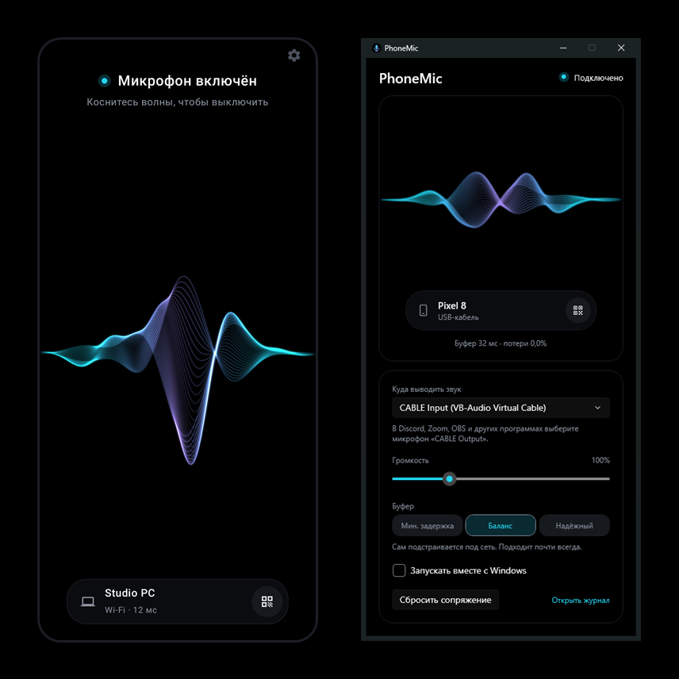
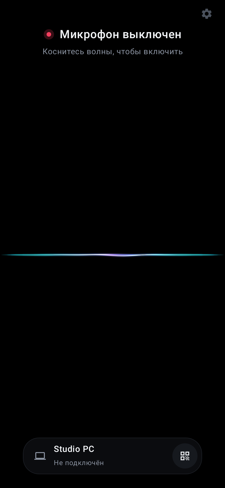
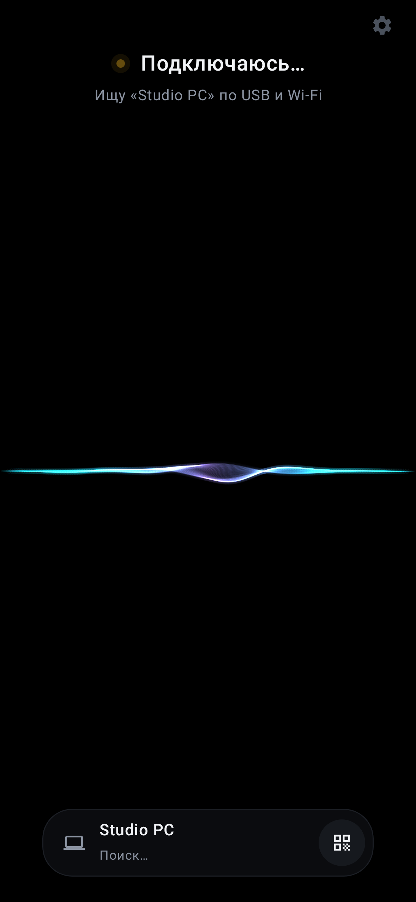
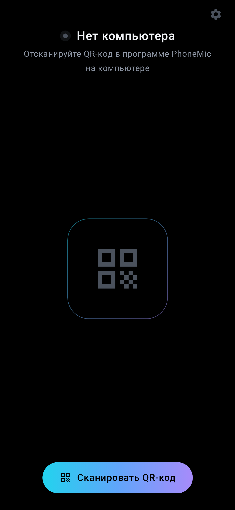
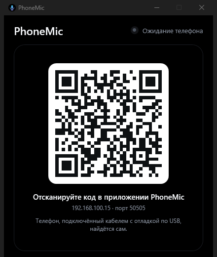

# PhoneMic

**Телефон на Android в роли микрофона для Windows — по Wi-Fi или по USB-кабелю.**

[](LICENSE)
[](https://github.com/shamil-aminov/PhoneMic/actions/workflows/ci.yml)

*English version: [README.md](README.md)*



---

PhoneMic передаёт звук с микрофона телефона на компьютер, где Discord, Zoom,
OBS и любые другие программы видят его как обычный микрофон. Сопряжение
делается один раз по QR-коду, дальше это одно касание на телефоне.

Проект появился потому, что похожие приложения обычно подводят в двух местах:
связь через какое-то время отваливается, а настройка отнимает время. PhoneMic
сделан так, чтобы не делать ни того, ни другого.

## Возможности

- **Сопряжение один раз по QR-коду.** Телефон запоминает компьютер и находит
  его, даже если у того сменился IP-адрес.
- **Wi-Fi или USB — автоматически.** Если на телефоне включена отладка по USB,
  программа на ПК сама настраивает связь по кабелю. Выдернули кабель — телефон
  сразу переходит на Wi-Fi. Вставили обратно — через несколько секунд
  возвращается на USB. Микрофон при этом не выключается.
- **Работает при выключенном экране.** Фоновый сервис и блокировки сна и Wi-Fi
  не дают Android заглушить приложение или усыпить радио.
- **Сам переподключается** после любого обрыва с любой стороны.
- **Адаптивный буфер**, который измеряет сеть и держит ровно столько звука,
  сколько нужно, в одном из трёх режимов (см. ниже).
- **Программа в трее** на ПК: индикатор уровня, громкость, выбор устройства,
  запуск вместе с Windows.
- **Только локальная сеть.** Без аккаунтов, облака и аналитики. Звук идёт
  напрямую с телефона на ПК.

## Экраны

| Выключен | Подключение | Первый запуск |
| :---: | :---: | :---: |
|  |  |  |

Волна — это и есть кнопка: коснитесь её, чтобы включить или выключить
микрофон. Она дышит вашим голосом на телефоне, а в окне на ПК — звуком,
который действительно дошёл. Точка над ней красная, когда микрофон выключен,
жёлтая, пока телефон ищет ПК, и голубая, когда вас слышно. Островок внизу —
сопряжённый компьютер; кнопка QR справа на нём сопрягает другой.
Шумоподавление — за значком шестерёнки.

Оба приложения чисто чёрные: на OLED-экране чёрный пиксель вообще не светится.

## Как это устроено


Windows не умеет превращать звук программы в микрофон без драйвера, поэтому
PhoneMic выводит звук в [VB-Audio Virtual Cable](https://vb-audio.com/Cable/) —
бесплатное и популярное виртуальное аудиоустройство. Его второй конец,
**CABLE Output**, и есть микрофон, который выбирается в других программах.

## Что нужно

- **ПК:** Windows 10 или 11, 64-бит, и
  [VB-Audio Virtual Cable](https://vb-audio.com/Cable/).
- **Телефон:** Android 8.0 или новее, с сервисами Google Play (для встроенного
  сканера QR-кодов).
- **Для Wi-Fi:** телефон и ПК в одной сети.
- **Для USB (по желанию):** отладка по USB на телефоне и `adb` на ПК — он
  входит в Android Studio и в
  [platform tools](https://developer.android.com/tools/releases/platform-tools).

## Начало работы

1. **Установите VB-Audio Virtual Cable** и перезагрузитесь, если установщик
   попросит.
2. **Скачайте PhoneMic** из [последнего релиза](../../releases/latest):
   `.apk` для телефона и `PhoneMic-…-windows-x64.exe` для ПК.
3. **Запустите программу на ПК.** Когда Windows спросит, можно ли PhoneMic
   пользоваться сетью, разрешите — иначе Wi-Fi не заработает. Появится QR-код.

   

4. **Установите приложение на телефон**, нажмите **«Сканировать»** и наведите
   камеру на QR-код.
5. **Коснитесь волны.** Точка над ней станет голубой, когда ПК начнёт
   принимать звук.
6. **В Discord, Zoom или OBS** выберите микрофон **CABLE Output**.

Если закрыть окно на ПК, программа уйдёт в трей и микрофон продолжит работать.
Выйти можно через меню значка в трее.

## Подключение

| | Wi-Fi | USB |
| --- | --- | --- |
| Настройка | не нужна | отладка по USB на телефоне, `adb` на ПК |
| Обычная задержка | 50–100 мс | 30 мс |
| Зависит от загруженности сети | да | нет |
| Заряжает телефон | нет | да |

Телефон всегда сначала пробует USB. По Wi-Fi он ищет ПК по всем адресам из
QR-кода, а если не нашёл — широковещательным запросом, поэтому новый IP от
роутера сопряжение не ломает.

## Режимы буфера

Wi-Fi доставляет пакеты неравномерно. Буфер на ПК измеряет, насколько
запаздывают пакеты, и держит ровно столько звука, чтобы это перекрыть. Разницу
он добирает, пропуская или растягивая паузы в речи, чего не слышно, а когда
пауз нет — меняя скорость воспроизведения не больше чем на 1%.

| Режим | Задержка | Когда |
| --- | --- | --- |
| Мин. задержка | 20–40 мс | USB или отличный Wi-Fi |
| Баланс (по умолчанию) | подстраивается, обычно 50–100 мс | почти всегда |
| Надёжный | 100–150 мс | загруженный или слабый Wi-Fi |

## Если что-то не так

**Щелчки или пропуски по Wi-Fi.** Подключите телефон к сети 5 ГГц вместо
2,4 ГГц, переключите буфер в «Надёжный» или используйте USB. Раз в 10 секунд
журнал (см. ниже) записывает разброс задержек сети — по нему видно, насколько
всё плохо на самом деле.

**Телефон не подключается по Wi-Fi.** Проверьте, что устройства в одной сети и
что брандмауэр Windows пропускает PhoneMic.exe (UDP и TCP, порт 50505). Сети с
изоляцией клиентов, например многие гостевые, блокируют это полностью — там
используйте USB.

**«Не удалось открыть микрофон».** Android выдаёт микрофон только приложению,
которое на экране в момент начала записи. Включайте PhoneMic на разблокированном
телефоне, после этого экран можно гасить. Ещё микрофон занимает телефонный
звонок, пока он идёт.

**USB перестаёт работать, пока установлен WO Mic.** Некоторые программы
приносят свою старую копию `adb`, и копии перезапускают сервер друг друга.
PhoneMic восстанавливается за три секунды, но лучше закрыть другую программу.

**Журнал** лежит в `%APPDATA%\PhoneMic\log.txt`, его открывает ссылка
«Открыть журнал» в окне на ПК.

## Приватность и безопасность

PhoneMic общается только с сопряжённым компьютером — по локальной сети или
по USB-кабелю. Серверов у него нет, больше он никуда ничего не отправляет.

Звук идёт по локальной сети **без шифрования**. Код сопряжения в QR не даёт
другим устройствам случайно подключиться к вашему микрофону, но не защищает от
того, кто намеренно слушает вашу сеть. В сети, которой вы не доверяете,
используйте USB-кабель.

## Сборка

Нужны Android Studio (или JDK 21+ и Android SDK) и .NET 10 SDK.

```bash
# Приложение для телефона
cd android
./gradlew assembleDebug

# Программа для ПК
dotnet build desktop/PhoneMic.sln
dotnet run --project desktop/src/PhoneMic
```

Релизные сборки, подпись и публикация описаны в
[docs/RELEASING.md](docs/RELEASING.md).

## Тесты

```bash
cd android && ./gradlew test                  # протокол на стороне телефона
dotnet test desktop/tests/PhoneMic.Core.Tests # протокол и симуляция сети на стороне ПК
```

Обе стороны проверяют одни и те же пакеты байт в байт (они перечислены в
[docs/protocol.md](docs/protocol.md#test-vectors)), поэтому изменение формата с
одной стороны ломает тесты другой. Буфер проверяется на симуляции сети с
виртуальным временем: десять минут передачи по плохому Wi-Fi с дрейфом часов
за несколько секунд.

Для сквозной проверки без человека в приложении есть отладочный режим с тоном
1 кГц вместо микрофона, а `probe` записывает то, что выходит из виртуального
кабеля, и сообщает частоту, уровень и провалы:

```bash
adb shell am start -n sh.aminov.phonemic/.MainActivity --ez autostart true --ez tone true
dotnet run --project desktop/tools/PhoneMic.Probe -- record "CABLE Output" 10
adb shell am start -n sh.aminov.phonemic/.MainActivity --ez stop true
```

## Устройство проекта

```
android/                        Приложение для телефона: Kotlin, Jetpack Compose
  audio/                        Запись звука, логика соединения
  net/                          Протокол, UDP и TCP
desktop/src/PhoneMic.Core/      Сервер, jitter-буфер, вывод звука, USB
desktop/src/PhoneMic/           Окно, QR-код, трей (WPF)
desktop/tests/                  Тесты протокола и симуляция сети
desktop/tools/PhoneMic.Probe/   Утилита для сквозной проверки
docs/protocol.md                Сетевой протокол с тестовыми векторами
```

## Участие

См. [CONTRIBUTING.md](CONTRIBUTING.md).

## Лицензия

[MIT](LICENSE). Сторонние компоненты перечислены в [NOTICE](NOTICE).
